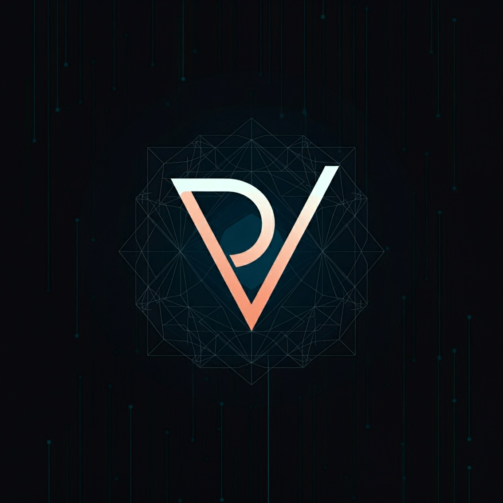

# 🩺 DERMAVISION



DERMAVISION is a cutting-edge telemedicine platform focused on dermatology, leveraging AI for skin disease prediction and streamlining doctor-patient interactions.

## 🌟 Features

- 👤 User Authentication (Patients & Doctors)
- 📊 Personalized Dashboards
- 🗓️ Appointment Booking System
- 🔬 AI-Powered Skin Disease Analysis
- 📚 Educational Resources on Skin Conditions
- 👨‍⚕️ Doctor Availability Management
- 📱 Responsive Design

## 🛠️ Tech Stack

- **Frontend:** React with Next.js
- **Backend:** Firebase (Authentication, Firestore)
- **Styling:** Tailwind CSS
- **Language:** TypeScript

## 🎨 Color Palette

- Background: `#171B26`, `#262A36`
- Text: `#EFEFED` (main), `#9C9FA4` (secondary)
- Accent: `#3B82F6`

## 🚀 Getting Started

1. Clone the repository
   ```
   git clone https://github.com/your-username/dermavision.git
   ```

2. Install dependencies
   ```
   cd dermavision
   npm install
   ```

3. Set up environment variables
   - Create a `.env.local` file in the root directory
   - Add necessary environment variables (refer to `.env.example`)

4. Run the development server
   ```
   npm run dev
   ```

5. Open [http://localhost:3000](http://localhost:3000) in your browser

## 📁 Project Structure
DERMAVISION PROJECT
├── pages/
│ └── api/
├── public/
├── src/
│ ├── app/
│ ├── components/
│ ├── contexts/
│ ├── Firebase/
│ ├── ml/
│ ├── services/
│ ├── types/
│ └── utils/
├── .env.local
├── next.config.js
├── tailwind.config.js
└── tsconfig.json
Ask
Copy
Apply


## 🤝 Contributing

We welcome contributions! Please see our [Contributing Guide](CONTRIBUTING.md) for more details.

## 📄 License

This project is licensed under the [MIT License](LICENSE).

## 📞 Support

For support, please email support@dermavision.com or join our [community chat](https://discord.gg/dermavision).

---

Made with ❤️ by the DERMAVISION Team
